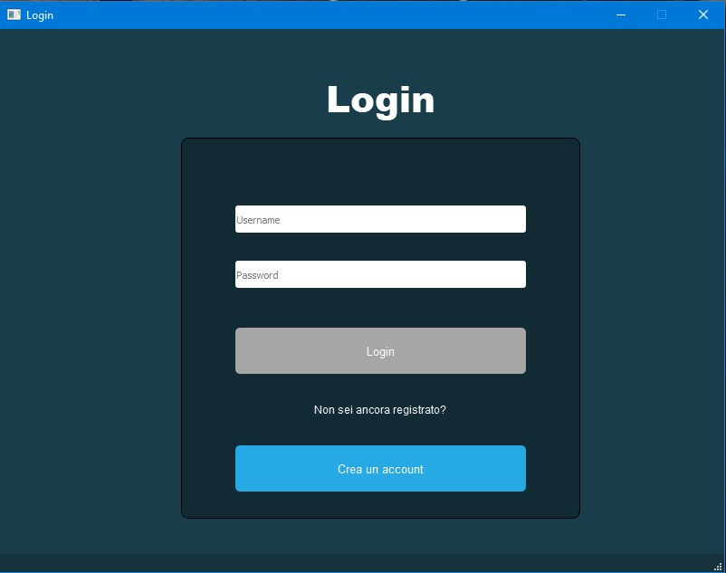
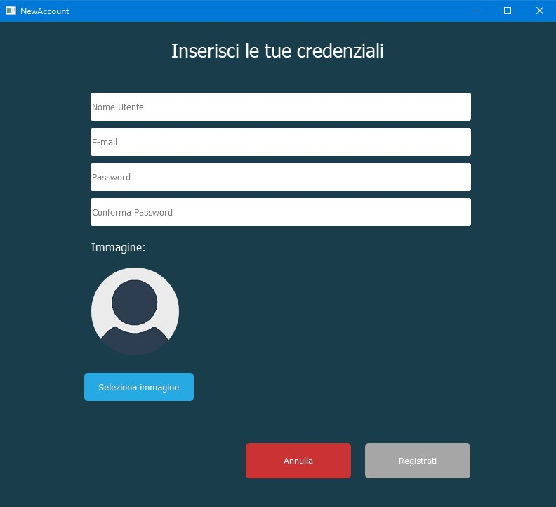
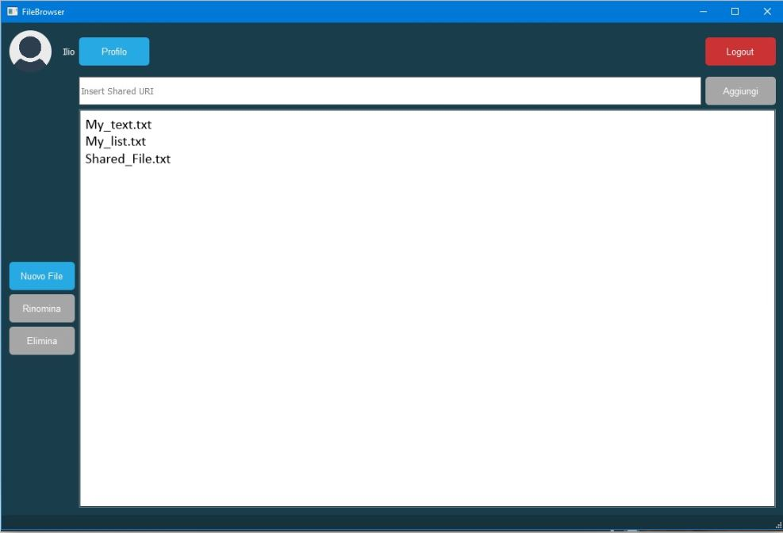
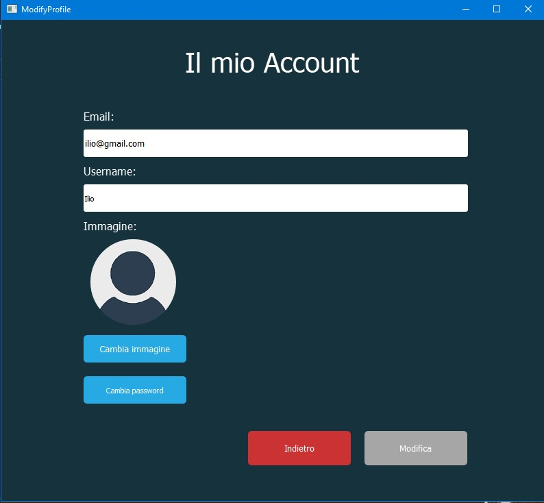
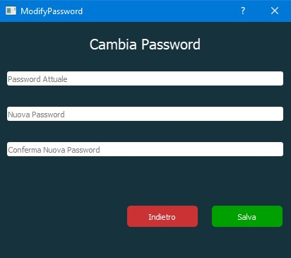

# Programmazione-Di-Sistema-Collaborative-Editor
### progetto per il corso di Programmazione di Sistema, @ Politecnico di Torino.

La disponibilità di connessioni a larga banda e l’esigenza di lavorare in gruppo senza richiedere necessariamente la compresenza degli attori nello stesso spazio fisico, spinge verso la realizzazione di sistemi di supporto al lavoro cooperativo sempre più efficaci. Un esempio pratico, può essere quello della suite Docs di Google, mediante la quale è possibile editare, in modo cooperativo e distribuito, documenti di varia natura (testi, fogli di calcolo, presentazioni). Tale suite è in grado di scalare su numeri anche grandi di utenti contemporanei: tale soluzione è basata su un insieme di server centralizzati che gestiscono il traffico da e verso i singoli client ed implementano la logica e gli algoritmi necessari a garantire la correttezza delle operazioni concorrenti.

Ciò che abbiamo realizzato in questo progetto, è un sistema di editing testuale cooperativo sfruttando il linguaggio C++. L'applicazione consente a uno o più utenti di modificare il contenuto di un documento in contemporanea, garantendo che operazioni di inserimento o modifica, svolte da più utenti in contemporanea, producano gli stessi effetti, indipendentemente dall’ordine con cui sono eseguite sui diversi sistemi in uso (proprietà di commutatività) e che cancellazioni ripetute portano allo stesso risultato (proprietà di idempotenza).

L’architettura del sistema è composta da due moduli indipendenti: un client ed un server.

-Il server è costituito da un processo costantemente attivo, in grado di accettare, attraverso la rete, connessioni provenienti dai client. Il 
server, al suo interno, mantiene un insieme di documenti che possono essere editati, in modo collaborativo dai client. Tali documenti sono 
archiviati sul file system del server, così da non perderne il contenuto in caso di accidentale interruzione del processo. Le operazioni di 
salvataggio sono eseguite automaticamente e non richiedono nessuna richiesta esplicita da parte dei client.

-I client sono processi discontinui (possono essere avviati e terminati in modo indipendente, secondo la volontà dell’utente), eseguiti  
all’interno di elaboratori connessi in rete con il server. I client offrono un’interfaccia grafica mediante la quale un utente può richiedere al
server di editare uno dei documenti attivi o chiedere di crearne uno nuovo, cui assegna un nome univoco. Quando il documento richiesto viene 
aperto, il client offre una tipica interfaccia da editor che permette di modificare il documento. Se due o più client modificano 
contemporaneamente il documento, il server garantisce che le operazioni effettuate generino, in ciascun client una rappresentazione coerente. 
I singoli client mostrano il numero e l’identità degli utenti che stanno modificando il documento corrente ed evidenziano la posizione del 
cursore dei diversi utenti all’interno del documento. Il client può evidenziare il testo introdotto dai diversi utenti utilizzando colori
differenti. 
 						
## Utilizzo					 				
			
Quando l’applicazione viene avviata vi troverete immediatamente nella schermata di login

Qui viene richiesto di inserire le proprie credenziali e di premere il tasto Login per accedere.

Nel caso invece si stia accedendo per la prima volta è necessario creare un nuovo account. Cliccando su ‘Crea un account’ si aprirà la pagina seguente:

Inserendo username, email, password e conferma della password verrà creato un nuovo account. È possibile scegliere un’immagine di profilo (nel caso in cui non venga fatto verrà assegnata in automatico un’icona di default).

Alla fine della creazione del un nuovo account verrete reindirizzati alla pagina di login per effettuare l’accesso.
Non appena avrete eseguito l’accesso verrete reindirizzati alla schermata principale:

Qui si possono visualizzare tutti i file a cui l’utente ha accesso.

In tale schermata si possono creare nuovi file o eliminare/rinominare quelli già esistenti. 

Inserendo l'URI di un documento a cui si è stati invitati a collaborare tale file verrà automaticamente aggiunto alla lista e potrà essere aperto in contemporanea ad altri utenti.

Cliccando invece sul bottone ‘Profilo’ si accede alla pagina che consente di modificare le proprie credenziali.

Andando invece ad aprire uno dei file contenuti nella finestra principale andremo nella pagine dell’editor di testo vero e proprio.

Nella parte più in alto troviamo tutte le operazioni principali come copia/incolla, export in formato PDF e le  le varie funzioni di arricchimento del testo (grassetto, corsivo, sottolineato, allineamento, …).Troviamo anche il tasto per recuperare l'URI del documento corrente, per un eventuale invito a collaborare. In alto a destra, troviamo infine l'icona dell'utente connesso, cliccando su tale icona si apre una nuova finestra che mostra i dettagli degli altri utenti che stanno in quel momento lavorando sul file.
